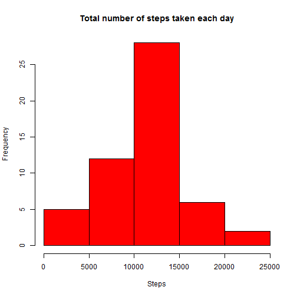
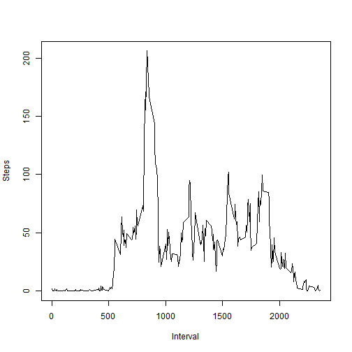
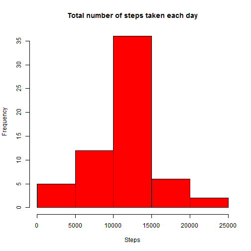

## Loading the data


```r
data <- read.csv('./activity.csv')
```

## What is mean total number of steps taken per day?

##### 1. Make a histogram of the total number of steps taken each day


```r
data1 <- aggregate(steps ~ date, data = data, sum)
hist(data1$steps, 
     xlab='Steps', 
     col='red', 
     main= 'Total number of steps taken each day')
```

 

##### 2. Calculate and report the mean and <b>median total number of steps taken per day

```r
medianv <- median(data1$steps)
meanv <- format(mean(data1$steps), digits=6)
```
The mean is 10766.2 and the median is 10765.


## What is the average daily activity pattern?

##### 1. Make a time series plot (i.e. type = "l") of the 5-minute interval (x-axis) and the average number of steps taken, averaged across all days (y-axis)


```r
data2 <- aggregate(steps ~ interval, data= data, mean)
plot(data2$interval,data2$steps, type='l', ylab='Steps', xlab='Interval')
```

 

#####2. Which 5-minute interval, on average across all the days in the dataset, contains the maximum number of steps?

```r
maxint <- subset(data2, steps == max(data2$steps))$interval
```

The 5-minute interval with the maximum number of steps is the interval 835.

## Imputing missing values

#####1. Calculate and report the total number of missing values in the dataset


```r
totalNA <- sum(is.na(data$steps))
```

The total number of missing values in the dataset is 2304.

#####2. Devise a strategy for filling in all of the missing values in the dataset. The strategy does not need to be sophisticated.

We will fill the NAs with the mean of the corresponding interval.

#####3. Create a new dataset that is equal to the original dataset but with the missing data filled in.


```r
data3 <- cbind(data,rep(data2$steps, length(data$steps)/length(data2$steps)))
names(data3) <- c(names(data),'means')
data3$steps[is.na(data$steps)] <- data3$means[is.na(data$steps)]
```

#####4. Make a histogram of the total number of steps taken each day and Calculate and report the mean and median total number of steps taken per day.


```r
data3p <- aggregate(steps ~ date, data = data3, sum)
hist(data3p$steps, 
     xlab='Steps', 
     col='red', 
     main= 'Total number of steps taken each day')
```

 

```r
newmedian <- format(median(data3p$steps), digits=6)
newmean <- format(mean(data3p$steps), digits=6)
```

After rebuild the dataset filling the missing values we get the mean been 10766.2 and the median 10766.2. We can see that the mean is exactly the same as in the first part of the assignment, while the median is slightly different but not enough to say that there's a significant change. The impact of imputing missing data on the estimates of the total daily number of steps is not critical. We get a different frequency for the occurrences, obviously, we are evaluating a different number of events. But when we see the statistics, we see that we get pretty much the same.

## Are there differences in activity patterns between weekdays and weekends?

#####1. Create a new factor variable in the dataset with two levels - "weekday" and "weekend" indicating whether a given date is a weekday or weekend day.


```r
dayInWeek <- ifelse(weekdays(as.Date(data3$date)) %in% c('sábado','domingo'), 
                    'weekend', 'weekday')
data4 <- cbind(data3,factor(dayInWeek))
names(data4) <- c(names(data3),'dayInWeek')
```

#####2. Make a panel plot containing a time series plot of the 5-minute interval (x-axis) and the average number of steps taken, averaged across all weekday days or weekend days (y-axis).


```r
library(lattice)
data4p <- aggregate(steps ~ interval+dayInWeek, data= data4, mean)
xyplot(steps~interval|dayInWeek,
       data=data4p,
       type='l',
       layout=c(1,2),
       ylab='Number of steps',
       xlab='Interval')
```

 
