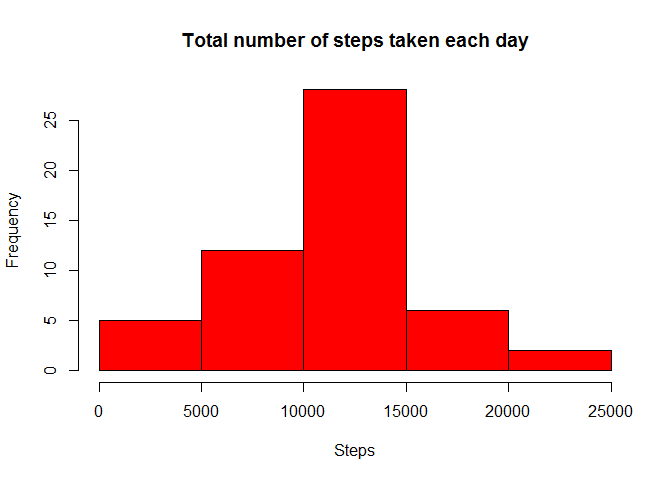

# Reproducible Research: Peer Assessment 1
  

## Loading the data


```r
data <- read.csv('./activity.csv')
```

## What is mean total number of steps taken per day?

##### 1. Make a histogram of the total number of steps taken each day


```r
data1 <- aggregate(steps ~ date, data = data, sum)
hist(data1$steps, 
     xlab='Steps', 
     col='red', 
     main= 'Total number of steps taken each day')
```

 

##### 2. Calculate and report the mean and <b>median total number of steps taken per day

```r
medianv <- median(data1$steps)
meanv <- format(mean(data1$steps), digits=6)
```
The mean is 10766.2 and the median is 10765.


## What is the average daily activity pattern?

##### 1. Make a time series plot (i.e. type = "l") of the 5-minute interval (x-axis) and the average number of steps taken, averaged across all days (y-axis)


```r
data2 <- aggregate(steps ~ interval, data= data, mean)
plot(data2$interval,data2$steps, type='l', ylab='Steps', xlab='Interval')
```

 

#####2. Which 5-minute interval, on average across all the days in the dataset, contains the maximum number of steps?

```r
max <- subset(data2, steps == max(data2$steps))$interval
```

The 5-minute interval with the maximum number of steps is the interval 835

## Imputing missing values


## Are there differences in activity patterns between weekdays and weekends?
